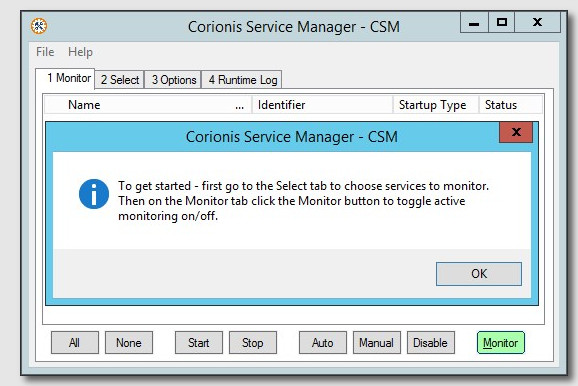

Go to the [**Main Page**](index). 
Go to the [**Documentation**](help).

Previous [Using the installer](usinginstaller).

# First Start
If no Windows services have been selected a reminder dialog is displayed: 
 
Click on the Select tab or press Alt-2 to begin selecting Windows services.

Previous [Using the installer](usinginstaller).

Go to the [**Documentation**](help). 
Go to the [**Main Page**](index).

---

### Blog
