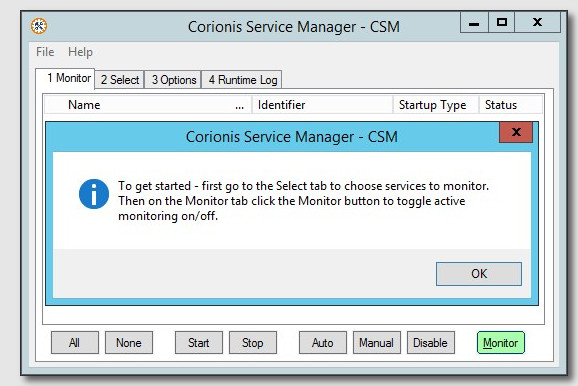

# Documentation

The Corionis Service Manager is a relatively simple program to install and use. 

## Getting Started

### First Start
If no Windows services have been selected a reminder dialog is displayed: 
 
Click on the Select tab or press Alt-2 to begin selecting Windows services.

### User Privileges

### Selecting Services

### Monitoring Services

### Options

### Runtime Log

## Advanced Topics

### Using The Keyboard

### The INI File

### The Available Icons
The Corionis Service Manager executable contains several round and square icons of different colors. These are useful if running multiple instances of CSM or if you just want a different shape or color.
