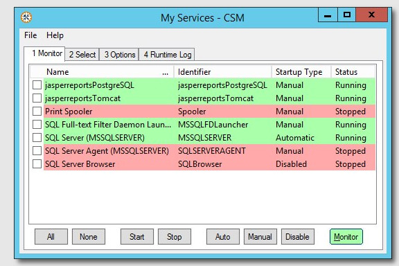
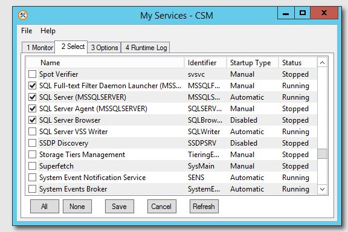
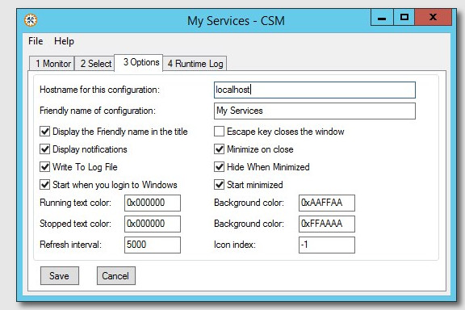

There are download choices, see [Using the MSI installer versus just the .exe](msi-vs-exe). 
Looking for the [User Documentation](help)? Need the [Downloads](downloads) for {{ site.version }}?

# What is the Corionis Service Manager?
Most people who regularly monitor and manage Windows services are only interested in a few.

The Corionis Service Manager (CSM) is a small Windows tray application that monitors and manages a list of user-selected Windows services. The selected services are monitored and may be easily started or stopped, the start-up type changed, etc.

Because it is a Windows tray app it is monitoring each service and always available. The utility may be popped up or down by double-clicking the tray icon. Notifications are displayed and logged when a selected service's state changes.

&nbsp;&nbsp;&nbsp;&nbsp;

CSM is free and open source distributed under the [MIT License](https://github.com/Corionis/CorionisServiceManager/blob/master/LICENSE.txt).

## Features
 * Monitors and manages a list of user-selected Windows services.
 * Select tab shows all Windows services available on the system.
 * Monitor and Select lists have multi-letter speed search for the service name.
 * Remembers state:
   - Window size & location.
   - Monitor & Select lists column sizes.
   - Whether active monitoring is enabled.
 * Logs running status changes of selected services.
 * Optional logging to a file.
 * Can be operated with the keyboard.

## Screenshots
CSM Monitor tab: 
 

CSM Select tab: 
 

CSM Options tab: 
 

## Download Files
The latest version of CSM is **{{ site.version }}**. See [Downloads](downloads) for the files. 

## User Documentation
The [User Documentation](help) is also the Online Help in the program.

## What is Corionis?
Corionis (core-E-on-iss) is a planet name from the science fiction series [Babylon 5](http://www.imdb.com/title/tt0105946/), thanks to [J. Michael Straczynski](http://www.imdb.com/name/nm0833089). It is also a trademark of Corionis, LLC. All Rights Reserved.

## Acknowledgements
 * The Corionis Service Manager is written using the [AutoIt](https://www.autoitscript.com/) scripting tool.
 * The MSI installer is built with the **free version** of [Advanced Installer](http://www.advancedinstaller.com/).
 * The graphics are created with [GIMP, the GNU Image Manipulation Program](https://www.gimp.org/).
 * The screenshots were taken with [Greenshot](http://getgreenshot.org/).
 * The project is hosted on [GitHub](https://github.com).
 * These pages are served by [GitHub Pages](https://pages.github.com/) and rendered with [Jekyll](https://jekyllrb.com/).
 * And use a (slightly modified) [Tactile](https://pages-themes.github.io/tactile/) theme.

---
### Blog
