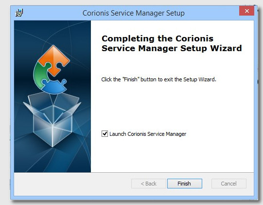

Go to the [**Main Page**](index). 
Go to the [**Documentation**](help).

Previous [Download Files](downloads). 
Next [First Start](firststart) dialog.

# Using the installer
The MSI Installer is a standard Wiindows Installer-based MSI.

## Running the installer
 There are at least two ways to run the installer.

### Technique 1 - Run the MSI from a file explorer
Using a file explorer you can navigate to the directory containing the downloaded MSI file.

Then right-click the MSI file and select Install: 
 

### Technique 2 - From a Command Prompt
Open a Command Prompt (DOS box) then enter: 
<code> msiexec /i "Corionis Service Manager_{{ site.version }}.msi" </code>

Don't forget the double-quotes around the filename.

## Installer dialogs

### Welcome
 
Click Next.

### Type of install
 
Select the type of installation.
 * Only for me installs a shortcut only for the user, and the .ini file is kept in the user's APPDATA directory.
 * Everybody (all users) installs a shortcut for everyone, and the .ini file is shared.

### Install folder
 
Choose where to install CSM. In most cases the default is recommended.

### Install ready
 
Click Install when ready.

### Install finished
 
Uncheck the run option if you wish. Click Finish when done.

Next [First Start](firststart) dialog. 
Previous [Download Files](downloads).

Go to the [**Documentation**](help). 
Go to the [**Main Page**](index).

---

### Blog
